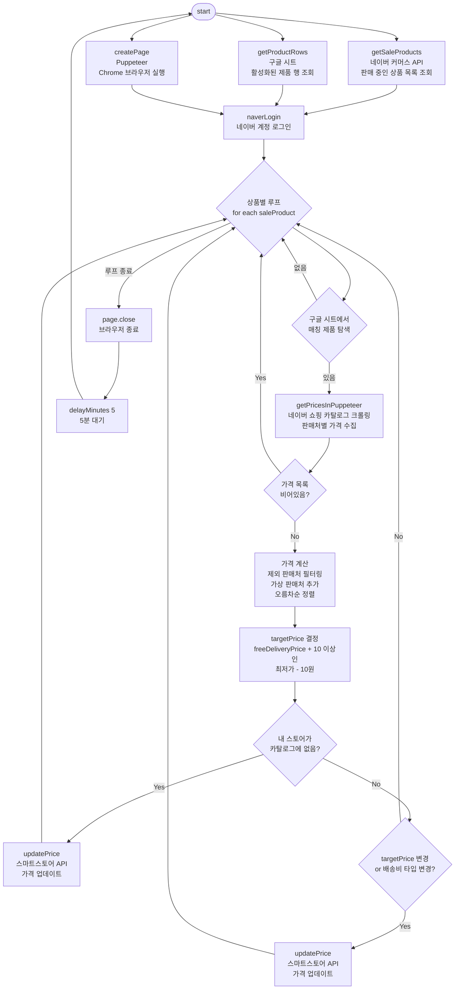

# smartstore-price-bot

네이버 스마트스토어 가격을 자동으로 경쟁사보다 낮게 유지해주는 봇입니다.  
구글 시트에 등록된 제품 목록을 기준으로, 네이버 쇼핑 카탈로그를 크롤링해 경쟁 판매처의 가격을 수집하고, 스마트스토어 API로 가격을 업데이트합니다.

## 실행 흐름



## 사용 기술

| 역할 | 기술 |
|---|---|
| 제품 카탈로그 관리 | Google Sheets API |
| 가격 크롤링 | Puppeteer |
| 가격 업데이트 | 네이버 커머스 API |
| 환경변수 관리 | dotenv |

## 환경변수 설정

프로젝트 루트에 `.env` 파일을 생성하세요.

```env
# 구글 시트
SHEET_ID=
SHEET_NAME=

# 네이버 커머스 API
CLIENT_ID=
CLIENT_SECRET=

# 네이버 로그인
NAVER_ID=
NAVER_PASSWORD=

# 스마트 스토어 이름
SMART_STORE_NAME=
```

## 구글 시트 컬럼 구조

| 컬럼 | 인덱스 | 설명 |
|---|---|---|
| A | 0 | 제품명 |
| B | 1 | 카탈로그 URL |
| C | 2 | 활성화 여부 (TRUE / FALSE) |
| G | 6 | 배송비 타입 (무료 / 유료 / 수량별) |
| H | 7 | 무료배송 기준 금액 |
| I | 8 | 최저 판매가 |
| J | 9 | 기본 배송비 |
| K | 10 | 가상 판매처 가격 |
| L | 11 | 제외 판매처 (쉼표 구분) |

## 실행

```bash
node app.js
```
